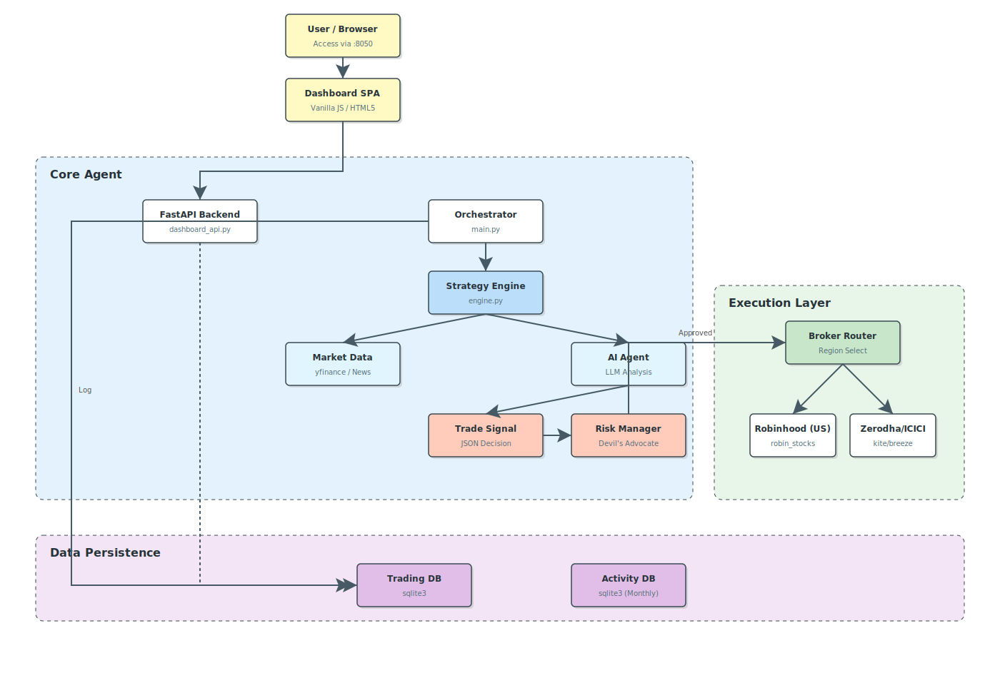

# 📖 Documentation

Welcome to the Autonomous Stock Trading Agent documentation.

## Quick Links

| Document | Description |
|----------|-------------|
| [Architecture](./architecture.md) | System design, data flow, and component interactions |
| [Configuration](./configuration.md) | Environment variables, watchlists, and broker setup |
| [Strategy Engine](./strategy-engine.md) | How the AI analysis pipeline works end-to-end |
| [Correlations](./correlations.md) | Cross-impact analysis (peers, macro sensitivities) |
| [Security & Safety](./security.md) | Financial safeguards, API key management, and best practices |
| [Dashboard Guide](./dashboard-guide.md) | Real-time monitoring dashboard features |
| [API Reference](./api-reference.md) | Database models, key functions, and data structures |

## Architecture Diagram

<p align="center">
  
</p>

## Getting Started

```bash
./setup.sh              # One-command setup
python main.py          # Start the agent
python dashboard_api.py  # Launch dashboard backend
```

See the main [README](../README.md) for full quick-start instructions.
